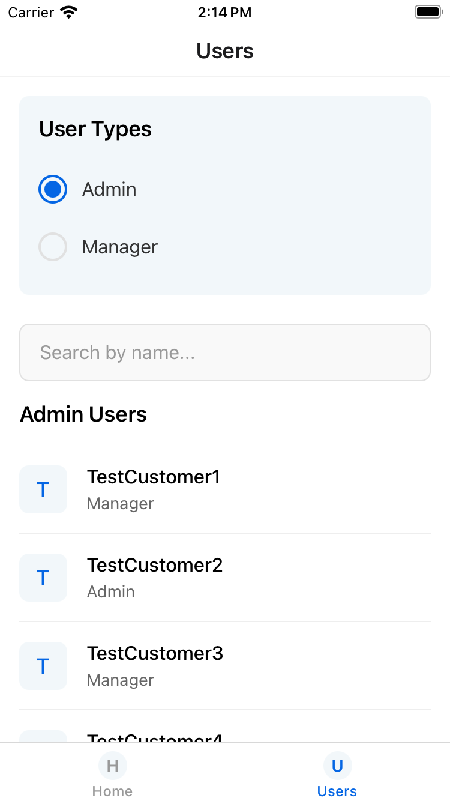

# UserList App

A React Native application for managing and displaying users with role-based filtering and search functionality.



## Features

- **User Management**: View and filter users with different roles (Admin, Manager)
- **Role-Based Filtering**: Toggle between different user types using a sleek UI
- **Search Functionality**: Search users by name with real-time filtering
- **Responsive UI**: Clean, modern interface using React Native components
- **GraphQL Integration**: Connects to AWS AppSync for data management
- **Pull-to-Refresh**: Easy data refreshing with pull-down gesture

## Implementation Details

This app demonstrates several advanced React Native and modern JavaScript concepts:

- **TypeScript**: Enhanced type safety throughout the application
- **GraphQL with Apollo Client**: Efficient data fetching with Apollo client
- **Enum Usage**: Implemented role types with TypeScript enums for better type safety
- **FlatList with Header Components**: Optimized list rendering with header components
- **Component Composition**: Clean architecture with reusable components
- **CSS-in-JS**: Styling with StyleSheet for maintainable UI code

### AWS AppSync Integration

The app uses AWS AppSync as its GraphQL backend:

- GraphQL queries for fetching users filtered by role
- API Key authentication with AWS AppSync
- Proper error handling and loading states

## Project Structure

```
src/
├── Constants/
│   ├── colors.ts       # Color definitions
│   ├── enums.ts        # TypeScript enums including UserRole
│   └── strings.ts      # String constants
├── graphql/
│   ├── aws-exports.js  # AWS AppSync configuration
│   ├── client.ts       # Apollo Client setup
│   ├── queries.ts      # GraphQL queries
│   └── schema.gql      # GraphQL schema
├── route/
│   └── index.tsx       # Navigation setup
└── screens/
    └── Users/
        ├── index.tsx         # Main Users screen
        ├── UserList.tsx      # User list component
        └── UserTypes.tsx     # Role selection component
```

## Technical Improvements

The app includes several technical improvements:

1. **Type Safety with Enums**: Replaced string constants with TypeScript enums for better type checking
2. **Optimized List Rendering**: Moved UserTypes and search into FlatList header to avoid nested scrollable views
3. **Enhanced Error Handling**: Improved error handling in GraphQL client
4. **Pull-to-Refresh**: Added RefreshControl to improve user experience
5. **AWS AppSync Integration**: Configured for both local development and production endpoints

## Setup and Running

### Prerequisites

- Node.js and npm installed
- React Native development environment setup
- An AWS account with AppSync API configured (or use the local mock)

### Installation

1. Clone the repository
2. Install dependencies:
   ```
   npm install
   ```
3. Update AWS AppSync configuration in `src/graphql/aws-exports.js` with your API details:
   ```javascript
   const awsExports = {
     aws_appsync_graphqlEndpoint: 'YOUR_API_ENDPOINT',
     aws_appsync_region: 'YOUR_REGION',
     aws_appsync_authenticationType: 'API_KEY',
     aws_appsync_apiKey: 'YOUR_API_KEY',
   };
   ```

### Running the App

For iOS:

```
npm run ios
```

For Android:

```
npm run android
```

## Testing

Run tests with:

```
npm test
```

The app includes unit tests for components and screens using Jest and React Testing Library.

## Future Enhancements

Potential improvements for future versions:

- User creation and editing functionality
- Pagination for large user lists
- Offline support with local caching
- Dark mode support
- Additional authentication methods
